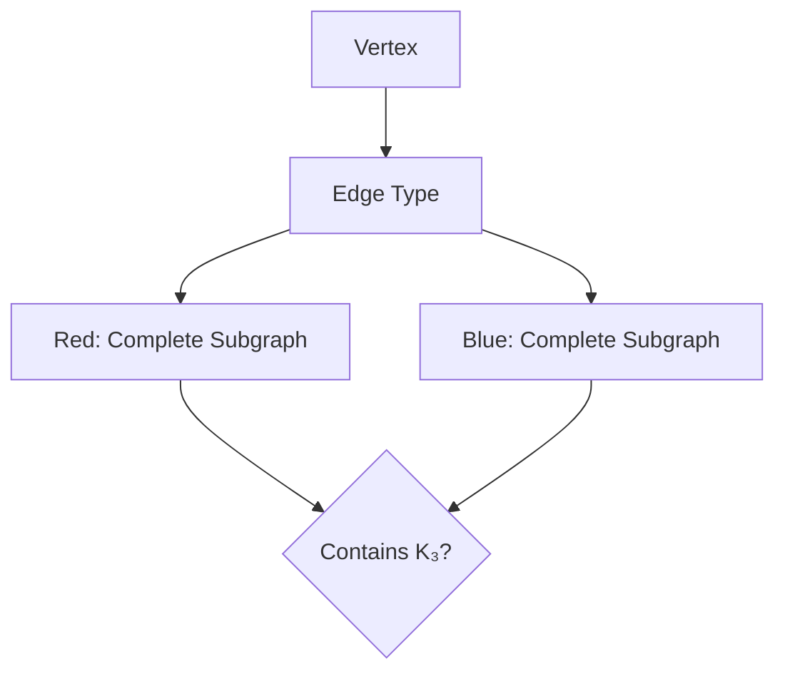

## Introduction to Ramsey Theory

Ramsey theory deals with finding order in chaos. The basic question: *How large must a structure be to guarantee a particular property?*

## Graph Coloring Problem

Consider a complete graph $K_n$ with edges colored red or blue. What is the smallest $n$ such that we must have either:

- A red triangle (complete subgraph $K_3$ with all red edges)
- A blue triangle (complete subgraph $K_3$ with all blue edges)

The answer is $R(3,3) = 6$.

## Visualization

## Key Result

$$R(3,3) = 6$$

This means any 2-coloring of the edges of $K_6$ contains a monochromatic triangle.
