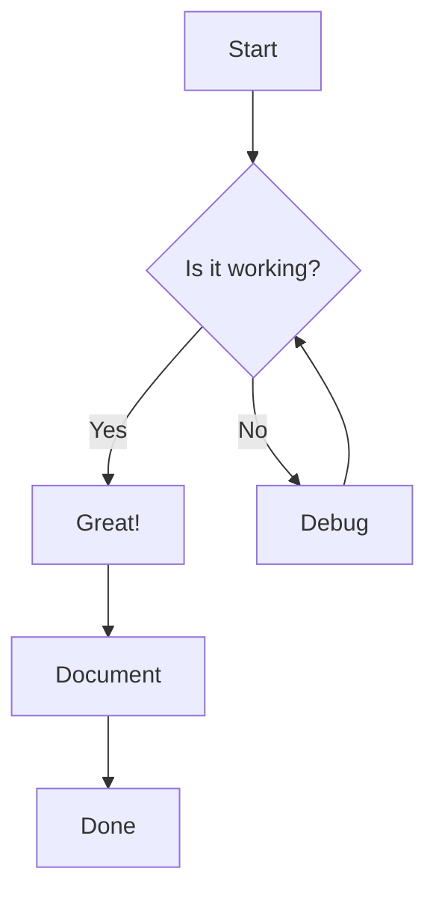
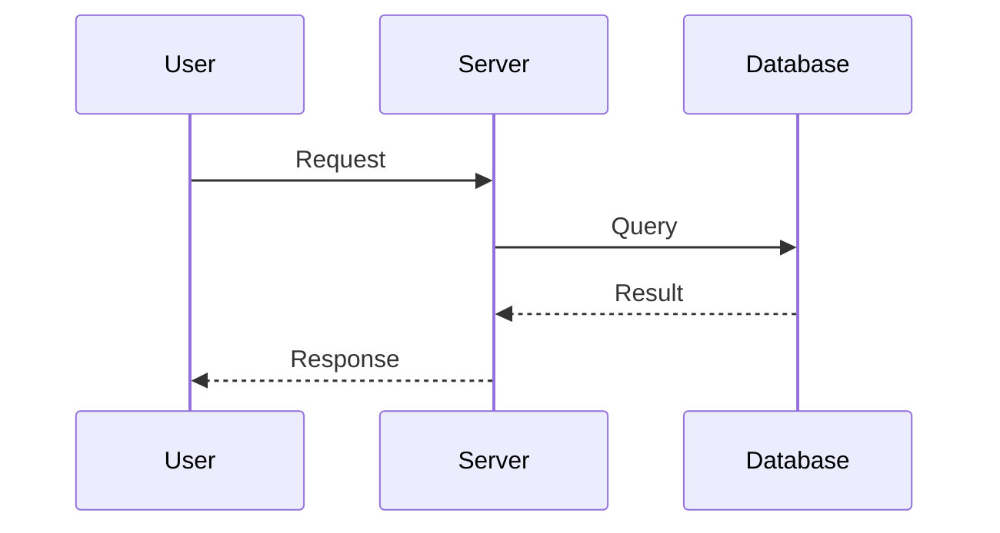
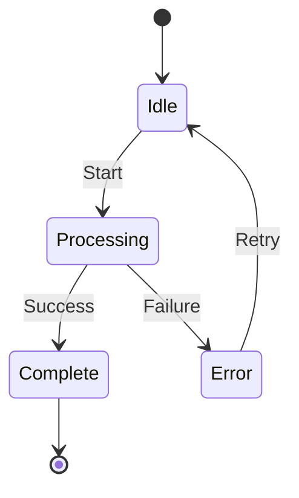

## Flowchart Example

```mermaid
flowchart TD
    A[Start] --> B{Is it working?}
    B -->|Yes| C[Great!]
    B -->|No| D[Debug]
    D --> B
    C --> E[Document]
    E --> F[Done]
```

## Sequence Diagram

```mermaid
sequenceDiagram
    participant U as User
    participant S as Server
    participant D as Database
    
    U->>S: Request
    S->>D: Query
    D-->>S: Result
    S-->>U: Response
```

## State Diagram

```mermaid
stateDiagram-v2
    [*] --> Idle
    Idle --> Processing: Start
    Processing --> Complete: Success
    Processing --> Error: Failure
    Complete --> [*]
    Error --> Idle: Retry
```
